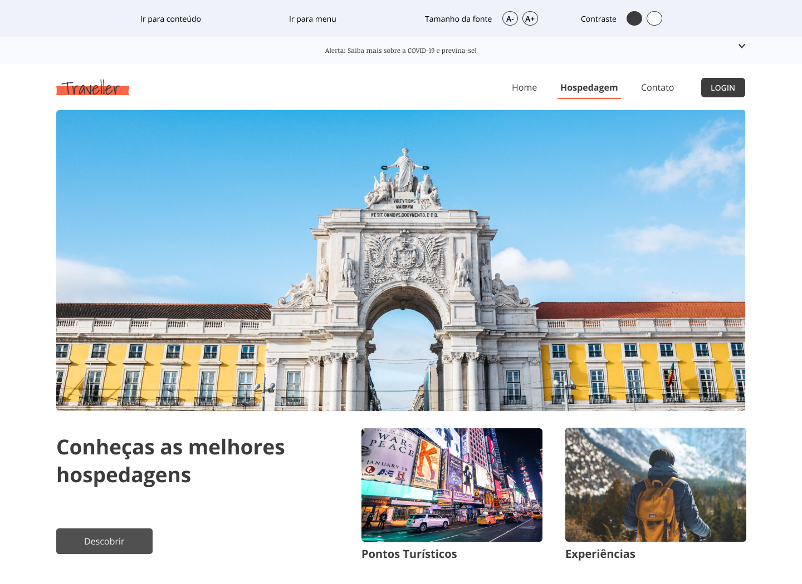
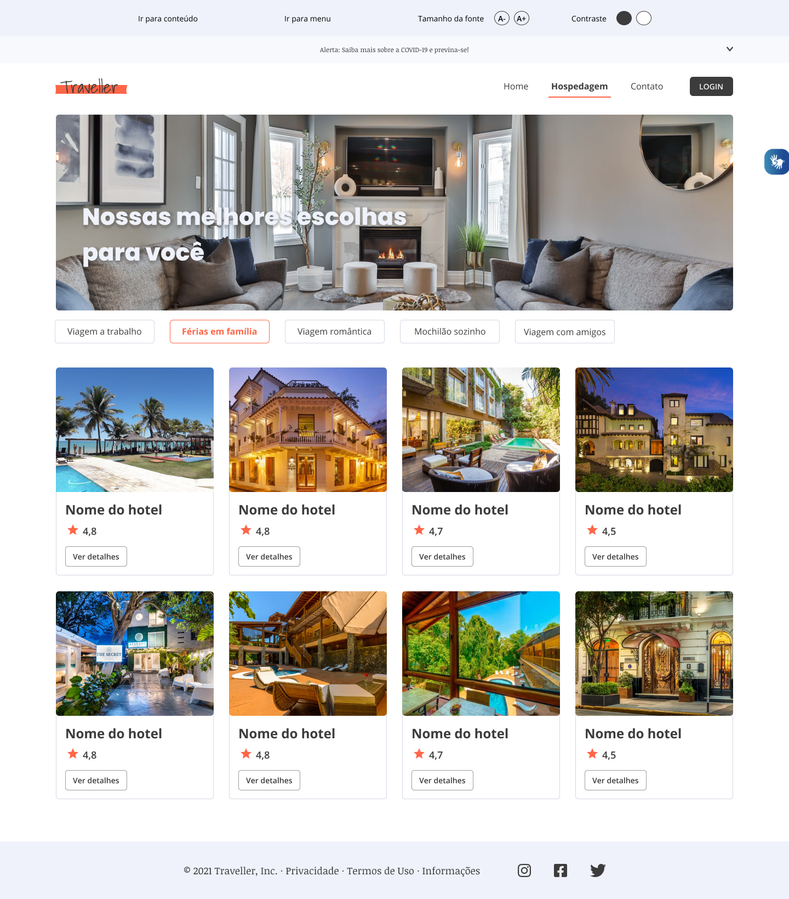

# projeto-traveller

<h3>Portal sobre viagens, cultura e história, com diversas funcionalidades que ajudarão o viajante a realizar as melhores escolhas.</h3>

Páginas desenvolvidas

<ul>
    <li>Home;</li>
    <li>Hospedagem;</li>
        <li>Detalhe da hospedagem;</li>
    <li>Contato;</li>
</ul>

# 

<strong>Link do protótipo no figma:</strong> https://www.figma.com/file/6StzrZMah1PzTLwj3Kgnwy/Gulliver-Project?node-id=0%3A1

# Imagens

